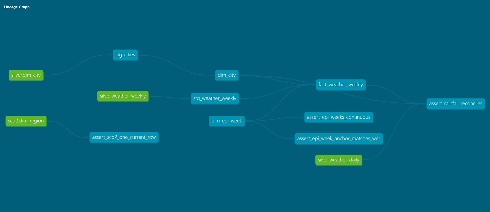

# DengueWatch LK 🦟

[](https://github.com/iiTzIsh/denguewatch-lk/actions/workflows/ci.yml)

**Automated dengue outbreak early-warning pipeline for Sri Lanka** — ingests weather and dengue surveillance data weekly, models it into a tested star schema, and (in progress) forecasts district-level outbreak risk 2–4 weeks ahead.

> ⚠️ **Disclaimer:** This is a portfolio project, **not official health advice**. For official dengue information see the [National Dengue Control Unit](https://www.dengue.health.gov.lk/).

---

## Why
Dengue outbreaks hit Sri Lanka every monsoon, and case counts usually become visible only after an outbreak has started. Rainfall today drives mosquito breeding weeks later, so combining weather with surveillance data can flag at-risk districts **before** cases spike — giving time for fogging and awareness work.

## Architecture
```
SOURCES                    INGEST (Airflow 3)            STORAGE (DuckDB, medallion)
Open-Meteo (weather) ─┐
WER PDFs (Epid. Unit) ─┼─→  Python extractors   ──→  BRONZE  raw CSV / HTML / PDF (never edited)
NDCU website          ─┘    retries · logging ·          ↓  load + validate
                            caching · idempotent     SILVER  weather_daily / weekly, reference tables
                                                         ↓  SCD2 (regions) + dbt build
                                                     GOLD    star schema: dim_epi_week, dim_city,
                                                             dim_region (SCD2), fact_weather_weekly
                                                         ↓  (planned)
                            ML forecast (LightGBM + MLflow) → FastAPI → Streamlit map → weekly alert
```



## What works today
| Area | Details |
|---|---|
| **Extraction** | Open-Meteo archive API for all **25 districts** (centroids from geoBoundaries/OSM), pinned to **ERA5-Land** for a consistent 2006→now series, resumable year-chunked backfill that stops cleanly on rate limits, retries/backoff, `fetched_at` lineage; WER listing scraper (robots.txt check, caching, regex parsing of epi weeks) |
| **Silver** | Multi-file load into DuckDB, **newest-pull-wins** de-duplication for overlapping pulls, orphan (referential) check |
| **Epi weeks** | Sri Lankan epidemiological weeks run **Saturday → Friday**; calendar dimension 2006–2027 validated against WER dates |
| **SCD Type 2** | Region dimension built from dated reference snapshots (hash change detection, point-in-time joins, idempotent, out-of-order guard) — *currently demo data* |
| **Gold (dbt)** | `dbt-duckdb` staging + marts, **21 data tests** (unique, not_null, relationships, accepted values, ranges, grain, reconciliation vs silver) + docs |
| **Orchestration** | **Airflow 3.3.2** (LocalExecutor, Docker Compose): weekly DAG `extract → silver → SCD2 → dbt build → dbt docs`; separate WER DAG so a flaky government site doesn't block the pipeline |
| **Dashboard** | Streamlit: district map of weekly cases, KPIs, national + district trends, rainfall 1–4 weeks earlier, table view, data-freshness line and disclaimer |
| **Quality** | GitHub Actions CI on every push: ruff + mypy + pytest, the **full pipeline + dbt build on sample data**, and Airflow DAG integrity; real-PDF regression tests; config via environment variables |

## Run it
**Local (Python 3.11+):**
```bash
python -m venv .venv && .venv\Scripts\activate          # Windows
pip install -r requirements.txt -r requirements-dbt.txt
python -m src.extract.weather_backfill                   # 2006 -> now, resumable
python -m src.pipeline                                    # silver -> SCD2 -> dbt build
pytest
```
**Docker (one-off pipeline run):**
```bash
docker compose run --rm pipeline
```
**Dashboard (Streamlit):**
```bash
pip install -r requirements-dashboard.txt
streamlit run dashboard/app.py                            # http://localhost:8501
```
**Airflow (scheduled):**
```bash
docker compose -f docker-compose.airflow.yml up airflow-init
docker compose -f docker-compose.airflow.yml up -d        # UI: http://localhost:8080
```

## Project layout
```
dags/            Airflow DAGs
dbt/             dbt project (staging + marts + tests)
src/extract/     weather.py, wer_links.py, wer_pdf.py
src/load/        DuckDB loading, SQL runner
src/transform/   SCD2 region dimension
reference/       small versioned reference data (districts, MOH snapshots)
infra/airflow/   Airflow image (dbt in its own virtualenv)
tests/           pytest
docs/            data model, source notes, design decisions
```

## Data sources
| Source | Use | Notes |
|---|---|---|
| [Open-Meteo](https://open-meteo.com/) | Daily rainfall & temperature (ERA5-Land) | Free archive API, no key · CC BY 4.0 |
| [geoBoundaries](https://github.com/wmgeolab/geoBoundaries) | District boundaries → centroids | gbOpen LKA ADM2, from OpenStreetMap · ODbL 1.0 |
| [Epidemiology Unit – WER](https://www.epid.gov.lk/weekly-epidemiological-report) | Weekly dengue history (PDF) | Listing covers 2006–2024; site intermittently returns HTTP 500 |
| [NDCU](https://www.dengue.health.gov.lk/) | Recent MOH-level cases | Planned |

## Roadmap
- [x] Phase 0 – Foundations: tested extractors, DuckDB, Docker, Airflow, dbt
- [ ] Phase 1 – Ingestion: ~~district coordinates~~ ✅, weather backfill 2006→now, NDCU + WER ingestion
- [ ] Phase 2 – Silver: WER PDF table parser, region mapping (real MOH changes), quality gates
- [ ] Phase 3 – Gold: dengue fact table, ML feature mart (lags, endemic channel)
- [ ] Phase 4 – ML: baselines vs LightGBM, walk-forward backtest, MLflow
- [ ] Phase 5 – Serving: ~~Streamlit + Folium map~~ ✅ (monitoring), FastAPI, weekly Top-5 alert
- [ ] Phase 6 – Production: GitHub Actions CI, drift monitoring, demo video
- [ ] Phase 7 – Cloud: Azure (Data Factory, storage) + Databricks Free Edition

## Author
**Ishara Madusanka** — BSc (Hons) IT (Data Science), SLIIT
