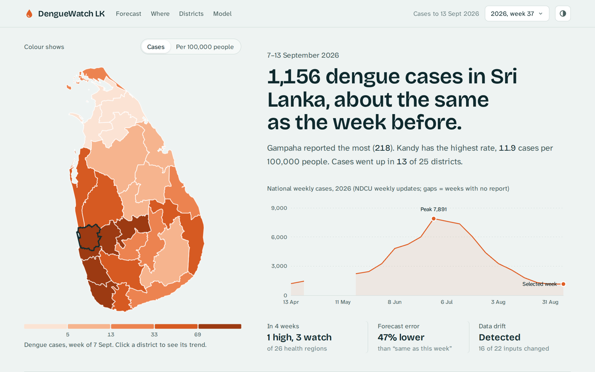

# DengueWatch LK 🦟

[](https://github.com/iiTzIsh/denguewatch-lk/actions/workflows/ci.yml)

**Automated dengue outbreak early-warning pipeline for Sri Lanka** — ingests weather and dengue surveillance data weekly, models it into a tested star schema, and forecasts outbreak risk for all 26 health regions 2 and 4 weeks ahead (LightGBM, tracked and versioned in MLflow).

> ⚠️ **Disclaimer:** This is a portfolio project, **not official health advice**. For official dengue information see the [National Dengue Control Unit](https://www.dengue.health.gov.lk/).



---

## Why
Dengue outbreaks hit Sri Lanka every monsoon, and case counts usually become visible only after an outbreak has started. Rainfall today drives mosquito breeding weeks later, so combining weather with surveillance data can flag at-risk districts **before** cases spike — giving time for fogging and awareness work.

## Architecture
```
SOURCES                    INGEST (Airflow 3)            STORAGE (DuckDB, medallion)
Open-Meteo (weather) ─┐
WER PDFs (Epid. Unit) ─┼─→  Python extractors   ──→  BRONZE  raw CSV / HTML / PDF (never edited)
NDCU website          ─┘    retries · logging ·          ↓  load + validate
                            caching · idempotent     SILVER  weather_daily / weekly, reference tables
                                                         ↓  SCD2 (regions) + dbt build
                                                     GOLD    star schema: dim_epi_week, dim_city,
                                                             dim_region (SCD2), fact_weather_weekly
                                                         ↓  gold.mart_ml_features (lags, rain 0-15 wks, endemic channel)
                            ML: walk-forward backtest → MLflow registry (@champion) → weekly batch scoring
                                                         ↓  ml.forecast_weekly
                                                 React dashboard · FastAPI · Telegram alert
```


## What works today
| Area | Details |
|---|---|
| **Extraction** | Open-Meteo archive API for all **25 districts** (centroids from geoBoundaries/OSM), pinned to **ERA5 (era5_seamless)** for a consistent 2006→now series with rainfall, >5% missing values rejects a pull, resumable year-chunked backfill that stops cleanly on rate limits, retries/backoff, `fetched_at` lineage; WER listing scraper (robots.txt check, caching, regex parsing of epi weeks) |
| **Silver** | Multi-file load into DuckDB, **newest-pull-wins** de-duplication for overlapping pulls, orphan (referential) check |
| **Epi weeks** | Sri Lankan epidemiological weeks run **Saturday → Friday**; calendar dimension 2006–2027 validated against WER dates |
| **SCD Type 2** | MOH region dimension built from the 233 MOH areas **observed** in NDCU PDFs (page-2 table parser): hash change detection, district change only when confirmed in 2 reports, point-in-time joins, incremental, out-of-order guard ([docs](docs/moh_regions.md)) |
| **Gold (dbt)** | `dbt-duckdb` staging + marts, **80+ data tests** (unique, not_null, relationships, accepted values, ranges, grain, reconciliation vs silver, no-leakage target alignment) + docs |
| **ML** | Feature mart in dbt (date-checked lags, rainfall 0–15 weeks back, endemic channel); baselines vs **LightGBM** growth model in a **walk-forward backtest** 2014–2025; every run in **MLflow**; model registry with **champion/challenger** promotion; monthly retrain DAG; weekly **batch scoring** to `ml.forecast_weekly` |
| **Monitoring** | **Forecast vs actual** vs naive (`gold.mart_forecast_accuracy`, as-of replay for honest history); **Evidently data drift** vs the same season in past years, alarm **calibrated on 2014–2025**; drift automatically triggers a retrain; "Model health" in the dashboard + `GET /model/health` |
| **Orchestration** | **Airflow 3.3.2** (LocalExecutor, Docker Compose): weekly DAG `extract → silver → SCD2 → dbt build → forecasts → alert` (+ dbt docs, drift check → retrain if drifted); `retrain_monthly`; separate ingest DAGs so a flaky government site doesn't block the pipeline; dbt and ML each in their own virtualenv |
| **Dashboard** | **React + TypeScript** (Vite, Tailwind, Radix UI) served by nginx; reads only the API. District choropleth (**MapLibre GL**, cases or per 100,000), a data-written headline, national curve with honest gaps, **2- and 4-week forecast bullets vs each region's outbreak level**, MOH hotspots, rain-vs-cases district view, forecast-vs-actual chart (**ECharts**) and drift status; light/dark themes with colour-blind-checked palettes; works on phones |
| **Alerts & API** | Weekly Telegram message (top districts + regions forecast near their outbreak level, stale forecasts hidden, sent once per week); read-only FastAPI incl. `/forecast`, typed responses, OpenAPI docs |
| **Quality** | GitHub Actions CI on every push: ruff + mypy + pytest, the **full pipeline + dbt build on sample data**, Airflow DAG integrity, and the web app's type check + build; real-PDF regression tests; config via environment variables |

## Forecast results
Walk-forward backtest (train on past years only, test each year 2014–2025, 16,250 region-weeks). Mean absolute error in weekly cases per region:

| Model | 2 weeks ahead | 4 weeks ahead |
|---|---|---|
| "Same as this week" (naive) | 15.49 | 21.62 |
| LightGBM, no weather | 15.25 | 19.59 |
| **LightGBM + weather** | **15.03 (−3%)** | **18.99 (−12%)** |

**Out-of-sample 2026 epidemic** (model trained on data to mid-May only; NDCU weeks Jun–Sep 2026): error 48.5 vs 65.9 (−26%) at 2 weeks and 68.0 vs 121.0 (−44%) at 4 weeks. It picked up the **turn after the July peak**; it under-forecast the **start** of the rise. Rain 12–15 weeks earlier is a top feature at 4 weeks, close to the ~3-month lag reported for Gampaha (Withanage et al. 2018). Details: [docs/ml_features.md](docs/ml_features.md).

## Guides
- [How the whole system works](docs/SYSTEM_GUIDE.md): Telegram alert, API, Airflow, MLflow, retraining, monitoring, data quality, CI
- [How to read the dashboard](docs/DASHBOARD_GUIDE.md)

## Run it
**Quick start: one command (Docker Desktop):**
```bash
git clone https://github.com/iiTzIsh/denguewatch-lk && cd denguewatch-lk
docker compose up -d                  # MLflow → setup (data, dbt, model, forecasts) → API + dashboard
docker compose logs -f init           # watch setup; "DengueWatch LK is ready" when done
```
Then open the dashboard at **http://localhost:3000**, the API at http://localhost:8000/docs and MLflow at http://localhost:5000.
Setup ([src/bootstrap.py](src/bootstrap.py)) downloads the WER history, NDCU PDFs and 20 years of weather, runs every data check, trains and registers the model, and makes forecasts. Open-Meteo's free daily limit covers about 450 of the 525 weather downloads, so re-run `docker compose run --rm init --force` the next day to finish. It continues where it stopped, and the system works in the meantime.

**Local (Python 3.11+):**
```bash
python -m venv .venv && .venv\Scripts\activate          # Windows
pip install -r requirements.txt -r requirements-dbt.txt
python -m src.extract.weather_backfill                   # 2006 -> now, resumable
python -m src.pipeline                                    # silver -> SCD2 -> dbt build
pytest
```
**Docker (one-off pipeline run):**
```bash
docker compose run --rm pipeline
```
**Dashboard (React):** — how to read it: [docs/DASHBOARD_GUIDE.md](docs/DASHBOARD_GUIDE.md)
```bash
docker compose up -d web                                  # http://localhost:3000 (starts the API too)
cd web && npm install && npm run dev                      # development with live reload (Node 22+, API on :8000)
```
**REST API (FastAPI):**
```bash
pip install -r requirements-api.txt
uvicorn src.api.main:app --reload                          # http://localhost:8000/docs
```
| Endpoint | Returns |
|---|---|
| `GET /health` | status + how fresh the dengue and weather data are |
| `GET /weeks` | ISO weeks with NDCU data |
| `GET /hotspots?week=2026-W37&top=5` | districts ranked by cases (default: latest week) |
| `GET /districts` · `GET /districts/{district}/trend` | district list · weekly cases + rainfall |
| `GET /forecast?top=5` | 2- and 4-week forecasts per region with risk level (latest batch, model version) |
| `GET /model/health` | forecast vs actual (vs naive) per model and horizon + latest data-drift check |
| `GET /moh/hotspots?week=2026-W37` | high-risk MOH areas NDCU listed that week |
| `GET /national/trend` · `GET /districts/{district}/rain?since=` | national weekly cases · continuous weekly rainfall |
| `GET /model/forecast-vs-actual?horizon=4` | national actual vs forecast vs naive per target week |
| `GET /geo/districts` | district boundaries (GeoJSON) for maps |

**ML (MLflow tracking + registry):**
```bash
pip install -r requirements-ml.txt
docker compose up -d mlflow                               # http://localhost:5000
python -m src.ml.backtest                                 # baselines vs LightGBM, all runs in MLflow
python -m src.ml.train                                    # train -> register -> promote to @champion if better
python -m src.ml.predict                                  # batch-score latest week -> ml.forecast_weekly
python -m src.ml.replay                                   # as-of replay of the last 16 weeks (honest history)
python -m src.ml.monitor                                  # Evidently drift check -> ml.drift_runs + HTML report
```

**Airflow (scheduled):**
```bash
docker compose -f docker-compose.airflow.yml up airflow-init
docker compose -f docker-compose.airflow.yml up -d        # UI: http://localhost:8080
```

## Project layout
```
dags/            Airflow DAGs
dbt/             dbt project (staging + marts + tests)
src/extract/     weather.py, wer_links.py, wer_pdf.py
src/load/        DuckDB loading, SQL runner
src/transform/   NDCU PDF parsers (district + MOH tables), SCD2 region dimension
src/ml/          features, models, backtest, train (registry), predict (batch scoring), risk rule
src/api/ · src/alerts/   serving: FastAPI, Telegram
web/             React dashboard (Vite + TypeScript), nginx config, Dockerfile
reference/       small versioned reference data (districts, population, MOH parent areas)
infra/airflow/   Airflow image (dbt in its own virtualenv)
tests/           pytest
docs/            data model, source notes, design decisions
```

## Data sources
| Source | Use | Notes |
|---|---|---|
| [Open-Meteo](https://open-meteo.com/) | Daily rainfall & temperature (ERA5, era5_seamless) | Free archive API, no key · CC BY 4.0 |
| [Census of Population and Housing 2024](https://www.statistics.gov.lk/Resource/en/Population/CPH_2024/CPH2024_Final_Eng.pdf) | District population → cases per 100,000 | Dept. of Census and Statistics, Final Report (10 Apr 2026), Table 3.2. Read from the PDF and checked against the printed totals |
| [geoBoundaries](https://github.com/wmgeolab/geoBoundaries) | District boundaries → centroids | gbOpen LKA ADM2, from OpenStreetMap · ODbL 1.0 |
| [Epidemiology Unit – WER](https://www.epid.gov.lk/weekly-epidemiological-report) | Original WER PDFs | Our scraper is ready; site returning HTTP 500 since 28 Sep 2026 |
| [NDCU](https://www.dengue.health.gov.lk/) | Weekly cases per RDHS (2026) | Weekly update PDFs (district table + high-risk MOH table), parsed + validated against printed totals; also the live case feed for forecasts after the WER history ends |
| [denguedatahub](https://github.com/thiyangt/denguedatahub) (Talagala) | **Weekly dengue history 2007–2026** per RDHS, from the Epidemiology Unit's WER | R package data, GPL-3, pinned commit; cross-checked against NDCU (ADR 0002) |

## Roadmap
- [x] Phase 0 – Foundations: tested extractors, DuckDB, Docker, Airflow, dbt
- [x] Phase 1 – Ingestion: district coordinates, weather backfill 2006→now, NDCU PDFs, WER history (denguedatahub)
- [x] Phase 2 – Silver: MOH areas from NDCU PDFs (SCD2 from observed data), Census 2024 population
- [x] Phase 3 – Gold: dengue fact tables (NDCU + WER), ML feature mart (lags, endemic channel)
- [x] Phase 4 – ML: baselines vs LightGBM, walk-forward backtest, MLflow tracking + registry, champion/challenger, monthly retrain
- [x] Phase 5 – Serving: React dashboard (MapLibre + ECharts), FastAPI, weekly Telegram alert — all with forecasts
- [x] Phase 6 – Production: GitHub Actions CI, forecast-vs-actual tracking, Evidently drift monitoring with automatic retrain trigger
- [ ] Portfolio polish: README screenshots, demo video, LinkedIn post
- [ ] Phase 7 – Cloud: Azure (Data Factory, storage) + Databricks Free Edition

## Author
**Ishara Madusanka** — BSc (Hons) IT (Data Science), SLIIT
