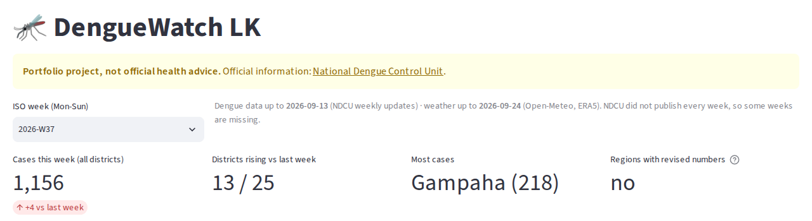
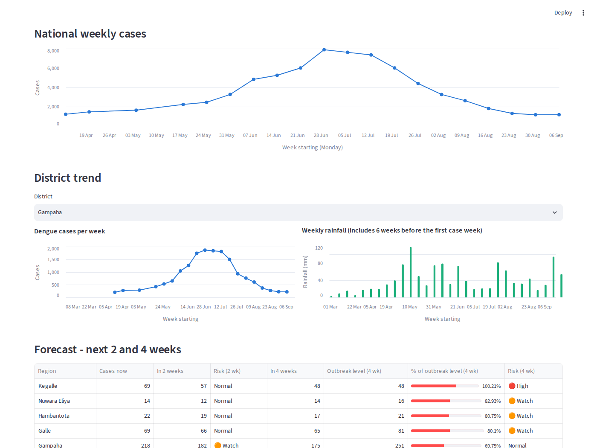
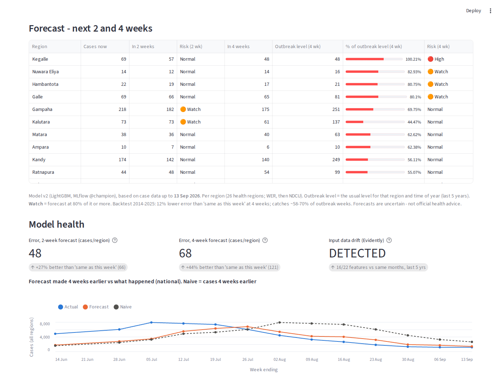
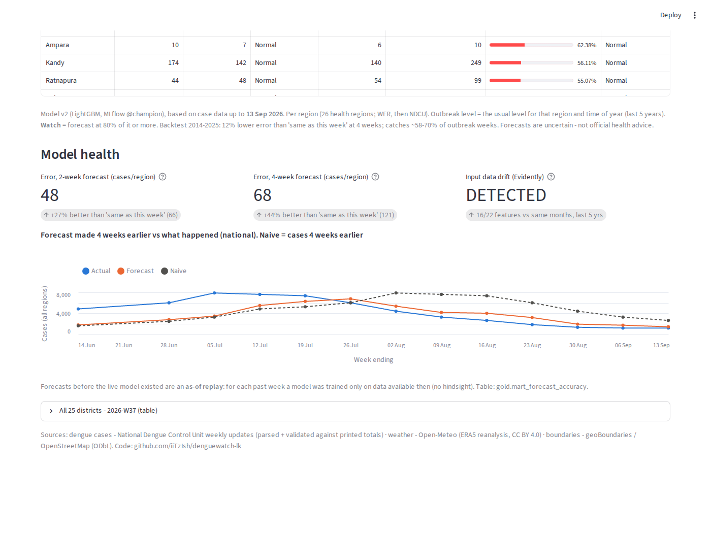

# DengueWatch LK: Dashboard Guide

How to read the dashboard, where every number comes from, and how to use it each week.
For the alert, API, Airflow, MLflow and the rest, see [SYSTEM_GUIDE.md](SYSTEM_GUIDE.md).

> Numbers and screenshots below are from the real data on **30 Sep 2026** (dengue data up to 13 Sep, weather up to 24 Sep).
> This is a portfolio project, not official health advice.

---

## 1. What the dashboard is for

The dashboard answers four questions, in this order, from top to bottom:

| # | Question | Section |
|---|---|---|
| 1 | **What is happening now?** Cases this week, and where | KPI tiles, map, Top 10 |
| 2 | **How did we get here?** The trend over the season | National chart, District trend |
| 3 | **What is coming next?** Which regions are heading for an outbreak | Forecast table |
| 4 | **Can we trust the forecast?** Is the model still working | Model health |

A health officer would read it top to bottom: *now → trend → next → trust*.

### Open it

```powershell
cd F:\DengueWatchLK
.\.venv\Scripts\Activate.ps1
streamlit run dashboard/app.py          # opens http://localhost:8501
```

**The dashboard only reads data. It never downloads or calculates anything itself.** Fresh numbers appear only after the pipeline runs (`python -m src.pipeline`, or Airflow every Monday). The page keeps data for **10 minutes**, so after a pipeline run either wait, or press **C** (clear cache) and then **R** (rerun). You can also use the **⋮ menu → Clear cache**.

---

## 2. Where the numbers come from (in one picture)

```
 SOURCES                         PIPELINE (every Monday)                        DASHBOARD SECTION
 ───────                         ───────────────────────                        ─────────────────
 NDCU weekly PDFs  ──►  parsed + checked against the printed Total  ──►  KPI tiles, map, Top 10, charts
 Open-Meteo weather ─►  daily → weekly rainfall per district         ──►  rain columns, rainfall chart
 WER history (2006→) ┐
 + NDCU (2026 →)     ├► ML feature table ─► LightGBM model (MLflow) ─►  Forecast table
 + weather           ┘                         │
                                               └► forecasts saved every week ─► Model health
                                                  + Evidently drift check     ─►   (forecast vs actual, drift)
```

| Dashboard section | Reads this table (DuckDB) | Made by |
|---|---|---|
| Tiles, map, Top 10, charts, full table | `gold.mart_ndcu_monitoring` | dbt (from NDCU PDFs + weather) |
| Rainfall chart | `gold.fact_weather_iso_weekly` | dbt (from Open-Meteo) |
| Forecast table | `ml.forecast_latest` | `src/ml/predict.py` (champion model) |
| Model health: errors + chart | `gold.mart_forecast_accuracy` | dbt (forecasts joined to actual cases) |
| Model health: drift | `ml.drift_runs` | `src/ml/monitor.py` (Evidently) |

---

## 3. Section by section

### 3.1 Header, week picker and freshness line



- **Yellow box**: the disclaimer. It must always be visible.
- **ISO week (Mon–Sun)**: choose which week the tiles, map and Top 10 show. The newest week is selected by default. `2026-W37` means the 37th ISO week of 2026 (07–13 Sep).
- **Freshness line**: how recent the data is. *"Dengue data up to 2026-09-13 · weather up to 2026-09-24."*
  → **Always check this first.** If the dengue date is old, the pipeline hasn't run.
- *"NDCU did not publish every week"*: some weeks (e.g. W18, W20) are missing on the NDCU website. The dashboard never makes them up.

### 3.2 The four KPI tiles

| Tile | What it means | Today | How it's calculated |
|---|---|---|---|
| **Cases this week** | All dengue cases reported that week, all 25 districts | **1,156**, **+4** vs last week | Sum of district cases. The small "+4" only appears if the previous week exists and is exactly 7 days earlier. Red = more cases (bad). |
| **Districts rising** | How many districts had more cases than the week before | **13 / 25** | Count of districts with change > 0 |
| **Most cases** | The district with the highest count | **Gampaha (218)** | Top row of the week |
| **Regions with revised numbers** | Did NDCU correct any earlier count? | no | NDCU often revises last week's number in the next report (late reports, duplicates). We keep the latest number. |

**How to read it:** 1,156 with +4 means the national count is **flat**, far below the June–July peak (7,891). But 13 of 25 districts rising means it's **flat overall, but mixed locally**, so look at the map and Top 10 to see where.

### 3.3 Map: "Cases by district"

- Each district is shaded **light → dark blue** by its cases that week. Grey = no data.
- **Hover** over a district to see: cases this week, change vs last week, and rain 2 weeks earlier.
- ⚠️ **The colours are relative to that week.** The darkest blue is always the week's highest district. A dark district in a quiet week may have fewer cases than a light one in a peak week, so compare numbers, not colours, across weeks.
- **Show: Cases / Cases per 100,000 people** (toggle above the map). Raw cases make big districts (Colombo, Gampaha) look worst. Per 100,000 uses the official **Census 2024** population, so districts are compared fairly. Example, W37: Gampaha has the most cases (218), but **Kandy has the highest rate (11.9 per 100,000)**.

### 3.4 Top 10 districts

| Column | Meaning |
|---|---|
| Cases | This week's count |
| vs last week | +16 = 16 more than last week (blank if last week is missing) |
| Rain 2 wk earlier (mm) | Total rain in the district 2 weeks before. Mosquitoes need standing water and about 1–3 weeks to breed. |

**Today:** Gampaha 218 (−6), Colombo 207 (−15), **Kandy 174 (+16)**, Kegalle 69 (+11), **Galle 69 (+22)**.
→ The two biggest districts are **falling**, and Kandy, Kegalle and Galle are **rising**. That's the "mixed" picture behind the flat national total.

### 3.5 National weekly cases



- One point = all districts' cases in one week (NDCU, 2026).
- **Today's story:** about 1,200 a week in April → **peak 7,891 in the week of 29 Jun** → back to about 1,150 in September. That's the 2026 SW-monsoon epidemic.
- ⚠️ Where a week is missing, the line joins the two nearest points. The straight segment is **not** real data.

### 3.6 District trend (choose a district)

Two charts side by side, on the **same dates**, so you can compare them by eye:

- **Left: dengue cases per week** for the chosen district.
- **Right: weekly rainfall**. It starts **6 weeks earlier** than the case data, because rain matters *before* cases.
- They are two separate charts on purpose. Putting cases and rain on one chart with two scales makes it easy to see patterns that aren't there.

**Practical example (Gampaha):** the heaviest rain week was **11 May (117 mm)**. Cases peaked about **7 weeks later (1,860 in the week of 29 Jun)**. This is the rain → mosquitoes → cases delay the model learns from. One district isn't proof, but it's the pattern to look for.

### 3.7 Forecast: next 2 and 4 weeks



This is the **early warning**. There's one row per **health region** (26 RDHS, so Ampara and Kalmunai are separate, unlike the 25 districts above). The riskiest regions are listed first.

| Column | Meaning |
|---|---|
| Cases now | Cases in the latest week (the forecast starts here) |
| In 2 weeks / In 4 weeks | The model's forecast of weekly cases 2 and 4 weeks later |
| **Outbreak level (4 wk)** | The **normal upper level** for this region at this time of year: based on the same ±2 weeks in each of the last 5 years (log scale, mean + 2 SD, at least 10 cases). Above it = unusual. |
| % of outbreak level | Forecast ÷ outbreak level. The bar goes up to 150%. |
| **Risk** | 🔴 **High**: forecast ≥ outbreak level · 🟠 **Watch**: forecast ≥ 80% of it · Normal: below · "Not enough history": can't judge |

**Why "Watch" starts at 80%:** the model tends to **under-forecast peaks**. In the 2014–2025 backtest, warning at 80% caught 58–70% of outbreak weeks, with 67–73% of warnings correct. That was the best balance.

**How to read today's table:**
- **Kegalle: High.** It's forecast at 48 in 4 weeks, which is 100% of its outbreak level (48). Note that the forecast is *falling* (69 → 57 → 48), but mid-October is normally quiet there, so even 48 would be unusually high **for the time of year**.
- **Nuwara Eliya, Hambantota, Galle: Watch** at 4 weeks (80–83% of their levels).
- **Gampaha, Kalutara: Watch** at 2 weeks.
- **Kandy** has 174 cases now but is **Normal**, because its outbreak level is high (249). Big counts aren't automatically outbreaks.

> **Key idea:** risk compares the forecast with what's **normal for that region at that time of year**, not with other regions. That's why a small region (Nuwara Eliya, 14 cases) can be on Watch while a big one (Kandy, 174) is Normal.

The caption under the table shows the **model version** (e.g. v2), the **date of the case data** the forecast is based on, and the backtest summary. If the forecast is older than 3 weeks, the Telegram alert hides it as stale.

### 3.8 Model health



This checks whether the forecasts are still working.

**Tile 1–2: forecast error (2-week and 4-week).**
- **48** = on average, the 2-week forecast missed by 48 cases per region per week.
- **"+27% better than 'same as this week' (66)"**: the simplest possible forecast, "next weeks = this week", missed by 66. The model's error is 27% lower. At 4 weeks, it's 68 vs 121 (**44% better**).
- Only forecasts whose week **has already happened** are counted.
- **Rule:** if this ever drops **below 0%**, the model is worse than doing nothing clever, and it needs attention.

**Tile 3: input data drift (Evidently).**
- Compares the last 8 weeks of model inputs (rain, temperature, case patterns) with the **same months in the previous 5 years**.
- **DETECTED (16/22 features)** means this season looks unusual compared with past years. That fits: 2026 had a big epidemic.
- The alarm threshold (60% of features) was **calibrated on history**: normal years score 23–55%, the 2017 epidemic 64%, 2026 **73%**.
- **What happens next:** drift automatically triggers a **retrain** in Airflow. The new model only replaces the current one if it's actually better (champion/challenger).

**Chart: "Forecast made 4 weeks earlier vs what happened".**
- 🔵 **Actual**: real national cases.
- 🟠 **Forecast**: what the model predicted **4 weeks before** that week.
- ⚫ dashed **Naive**: "same as 4 weeks earlier".
- **How to read it:** the orange line should sit closer to blue than the dashed line does.
  - **Rise (June):** orange is well below blue, so **the model was too slow to see the epidemic start**. This is its main weakness.
  - **Fall (August–September):** orange is close to blue and the dashed line is far above, so **the model saw the decline coming**. Naive kept predicting the peak.
- Forecasts from before the live model existed are an **as-of replay**: for each past week, a model was trained only on data available then, so there's no hindsight.

### 3.9 Bottom of the page

- **"All 25 districts – table"** (click to open): the full list for the selected week with exact numbers, including rain in the same week and 2 and 4 weeks earlier. Use it when you need exact values rather than colours.
- **Sources line**: NDCU (cases), Open-Meteo ERA5 (weather, CC BY 4.0), geoBoundaries / OpenStreetMap (map, ODbL).

---

## 4. A 5-minute weekly routine (how to "analyse" it)

Every Monday after the pipeline has run:

1. **Freshness**: is the dengue date last week? If not, stop. The data is old.
2. **Tiles**: national total up or down? How many districts rising?
3. **Top 10 + map**: *which* districts are rising? Any new names compared with last week?
4. **District trend**: for each rising district, did it have heavy rain 2–8 weeks ago? If it did, the rise may continue.
5. **Forecast table**: any 🔴 High or 🟠 Watch? Note them, starting with 4-week High.
6. **Model health**: is the model still better than naive (> 0%)? Is drift detected? If the model got worse, trust the forecast less this week.
7. **Write one sentence**, e.g.:
   > *"W37: national cases flat (1,156, +4), but Kandy, Galle and Kegalle rising. Model flags Kegalle HIGH and three regions on WATCH for mid-October. Model still 44% better than naive at 4 weeks; drift detected (post-epidemic season) → retrain triggered."*

---

## 5. Words you'll see

| Term | Plain meaning |
|---|---|
| **ISO week** | Week running Monday → Sunday, e.g. 2026-W37 = 07–13 Sep. NDCU uses these. |
| **Epi week** | Sri Lankan epidemiological week, Saturday → Friday. The older WER reports use these. |
| **District vs RDHS region** | 25 districts; 26 health regions (Ampara district is split into Ampara + Kalmunai). Map and Top 10 use districts, the forecast uses regions. |
| **Revised / restated** | NDCU changed a past week's number in a later report. We keep the latest. |
| **Outbreak level** | Normal upper limit for that region and time of year (last 5 years). Also called the "endemic channel". |
| **Watch / High** | Forecast at ≥ 80% / ≥ 100% of the outbreak level |
| **Naive forecast** | "Next weeks = this week". The minimum any model must beat. |
| **MAE (error)** | Average size of the miss, in cases |
| **Skill vs naive** | How much smaller the model's error is than naive's (+44% = 44% smaller) |
| **Drift** | This season's inputs look different from the same season in past years |
| **Champion** | The model version currently in use (MLflow registry). A new version replaces it only if it's better. |
| **As-of replay** | Rebuilt past forecasts that use only the data available at the time (no hindsight) |

---

## 6. Don't misread these

- **Counts vs rates.** Big districts always have more cases. Use the **per 100,000** toggle to compare districts fairly. The forecast table stays in counts per health region, because the census gives districts, not RDHS regions.
- **Map colours are relative to each week.** Compare numbers across weeks, not colours.
- **Missing NDCU weeks** show as straight lines on charts, not real data.
- **The forecast is uncertain.** It's good at seeing **declines** and **continuing trends**, and **slow at the start of a new rise**. In the 2014–2025 backtest, 2-week "Watch" warnings were right about 73% of the time.
- **Two case sources.** The model learned from WER history (to May 2026) and continues with NDCU. In the 3 weeks where both exist, NDCU is 5–11% higher. This is documented and not adjusted.
- **Not official advice.** For decisions, use the [National Dengue Control Unit](https://www.dengue.health.gov.lk/).

---

## 7. If you see a message instead of data

| Message | Meaning | Fix |
|---|---|---|
| "No warehouse found" | No database file yet | `python -m src.pipeline` |
| "The warehouse has no gold tables yet" | dbt hasn't built the tables | `python -m src.pipeline` |
| "No weather data for this period yet" | Weather backfill isn't finished | `python -m src.extract.weather_backfill`, then the pipeline |
| "No forecasts yet" | No model or no scoring run | `docker compose up -d mlflow` → `python -m src.ml.train` → `python -m src.ml.predict` |
| "No matured forecasts yet" | No forecast week has happened yet | `python -m src.ml.replay`, then `python -m src.pipeline` |
| Numbers didn't change after a pipeline run | 10-minute page cache | Press **C** then **R**, or ⋮ → **Clear cache** |

---

## 8. Checking a number yourself (the API)

Every number on the dashboard is also available as JSON:

```powershell
uvicorn src.api.main:app --reload       # then open http://localhost:8000/docs
```

| Try | You get |
|---|---|
| `/health` | Data freshness dates (same as the freshness line) |
| `/hotspots?week=2026-W37&top=5` | Top districts (same as Top 10) |
| `/districts/gampaha/trend` | The district trend chart's data |
| `/forecast?top=5` | The forecast table |
| `/model/health` | The model health tiles |

In the `/docs` page, click an endpoint → **Try it out** → **Execute**.
