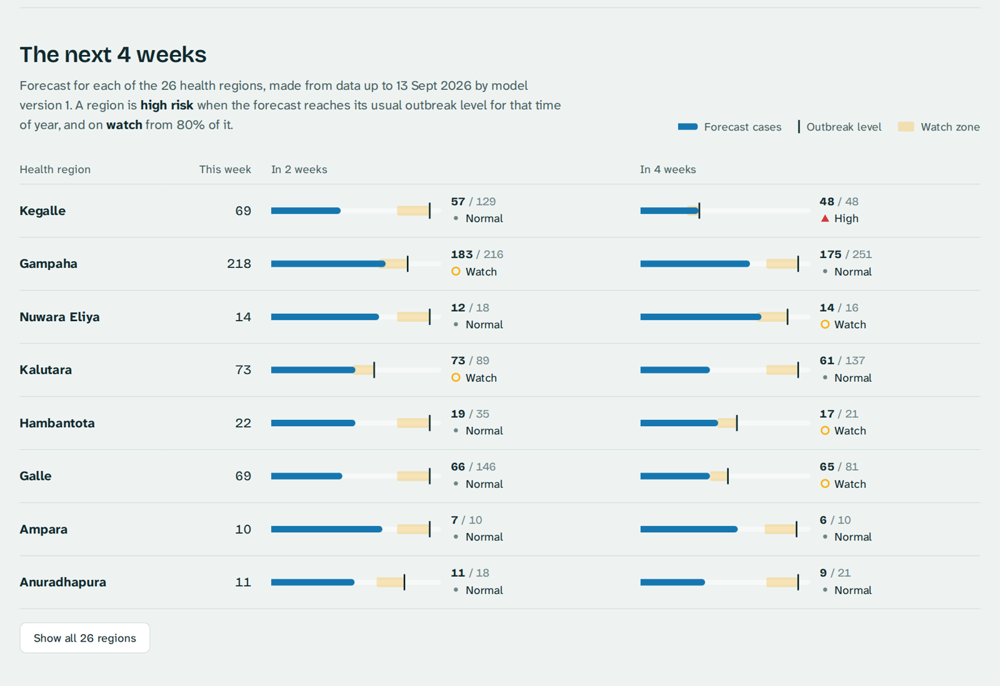
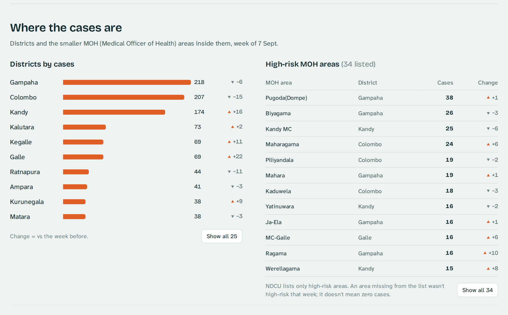
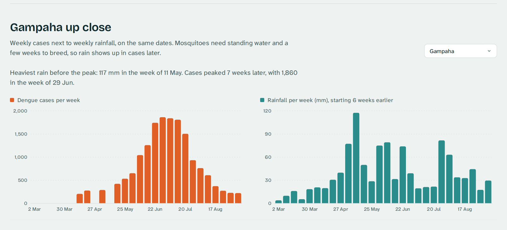
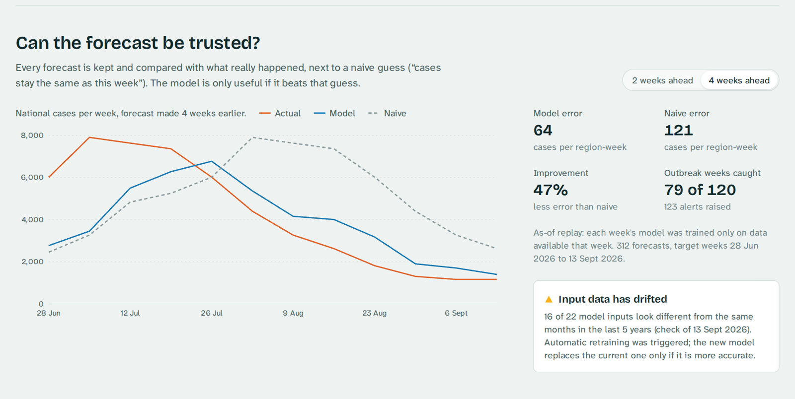

# DengueWatch LK: Dashboard Guide

This guide covers how to read the dashboard, where every number comes from, and how to use it each week.
For the alert, API, Airflow, MLflow and the rest, see [SYSTEM_GUIDE.md](SYSTEM_GUIDE.md).

> Numbers and screenshots are from the real data on **1 Oct 2026**: dengue data up to 13 Sep and weather up to 24 Sep.
> This is a portfolio project, not official health advice.

---

## 1. What the dashboard is for

It answers four questions, from top to bottom:

| # | Question | Section |
|---|---|---|
| 1 | **What is happening now?** Cases this week, and where | Top of the page: map, headline, national curve |
| 2 | **What is coming next?** Which regions are heading for an outbreak | The next 4 weeks |
| 3 | **Where exactly?** Districts, and the MOH areas inside them | Where the cases are, District up close |
| 4 | **Can we trust the forecast?** Is the model still working | Can the forecast be trusted? |

### Open it

```powershell
cd F:\DengueWatchLK
docker compose up -d          # then open http://localhost:3000
```

For development with live reload (needs Node 22+), see [web/README.md](../web/README.md).

**The dashboard only reads data. It never downloads or calculates anything itself.** Fresh numbers appear after the pipeline runs (Airflow every Monday, or `docker compose run --rm pipeline`). Reload the page to see them.

### How it's built

```
Browser ──► web (nginx :3000) ──/api/*──► api (FastAPI :8000) ──► DuckDB warehouse (read-only)
            React app: charts (ECharts), map (MapLibre), data hooks (TanStack Query)
```

- **React + TypeScript** (Vite) and Tailwind CSS. Controls are **Radix UI**, so they work with the keyboard and screen readers.
- The page has **no data of its own**. Every number comes from the API, so the dashboard and the API can never disagree.
- The **theme button** (top right) switches between system, light and dark. Each mode has its own chart colours, checked for colour-blind safety and contrast.

---

## 2. Where the numbers come from

| Section | API endpoint | Warehouse table | Made by |
|---|---|---|---|
| Map, headline, district ranking | `/hotspots?week=` | `gold.mart_ndcu_monitoring` | dbt (NDCU PDFs + weather + Census 2024) |
| National curve | `/national/trend` | `gold.mart_ndcu_monitoring` | dbt |
| MOH areas | `/moh/hotspots?week=` | `gold.fact_dengue_moh_weekly` | NDCU page-2 parser → dbt |
| District up close | `/districts/{d}/trend`, `/districts/{d}/rain` | `gold.mart_ndcu_monitoring`, `gold.fact_weather_iso_weekly` | dbt |
| The next 4 weeks | `/forecast` | `ml.forecast_latest` | `src/ml/predict.py` (champion model) |
| Forecast vs actual | `/model/forecast-vs-actual`, `/model/health` | `gold.mart_forecast_accuracy` | dbt (forecasts joined to actual cases) |
| Drift | `/model/health` | `ml.drift_runs` | `src/ml/monitor.py` (Evidently) |
| Map shapes | `/geo/districts` | `reference/geo/lka_districts.geojson` | geoBoundaries / OpenStreetMap (ODbL) |

---

## 3. Section by section

### 3.1 Top bar

- **Week picker**: chooses the week for the map, headline, rankings and MOH list. The newest week is selected by default. "2026, week 37" is ISO week 37 (Mon 7 – Sun 13 Sep).
- **"Cases to 13 Sept 2026"**: how fresh the data is. **Check this first.** If the date is old, the pipeline hasn't run.
- The **Forecast / Where / Districts / Model** links jump to each section.

### 3.2 Top of the page: map, headline, national curve


**Headline.** It's written from the data each week: *"1,156 dengue cases in Sri Lanka, about the same as the week before."* The sentence under it names the district with the most cases (Gampaha, 218), the highest rate (Kandy, 11.9 per 100,000) and how many districts went up (13 of 25).
→ The national total is flat, but more than half the districts are rising. **Flat overall, mixed locally.**

**Map.**
- Districts are coloured from light to dark in 5 steps. The numbers under the colour bar are the step limits (5, 13, 33, 69 cases).
- **Cases / Per 100,000 people** switches the colouring. Raw cases always make big districts look worst. Per 100,000 uses the official **Census 2024** population, so districts are compared fairly.
- **Hover** a district to see its cases, rate and change. **Click** it to open its trend further down the page. The selected district has a dark outline.
- ⚠️ The steps are recalculated each week from that week's values, so **compare numbers across weeks, not colours**.

**National curve.** This shows all districts' cases per week in 2026: about 1,200 a week in April, a **peak of 7,891 in the week of 29 Jun**, then down to about 1,150. The selected week is marked.
- **Gaps are weeks with no report loaded.** The line breaks there instead of drawing a fake straight line, and a week with no neighbour on either side shows as a dot.

**Three facts under the curve:** the forecast summary (1 high, 3 watch in 4 weeks), the model's error vs the naive guess (47% lower) and the drift status. Each one links to its section.

### 3.3 The next 4 weeks



This is the **early warning**. There's one row per **health region**: 26 RDHS regions, where Ampara district is split into Ampara and Kalmunai. The riskiest regions come first.

How to read one bar:

| Part | Meaning |
|---|---|
| **Blue bar** | Forecast cases for that week |
| **Dark tick** | **Outbreak level**: the normal upper limit for this region at this time of year. It comes from the same ±2 weeks in each of the last 5 years (log scale, mean + 2 SD, at least 10 cases). |
| **Light yellow band** | **Watch zone**: 80–100% of the outbreak level |
| **"48 / 48"** | Forecast / outbreak level |
| **Risk** | ▲ **High**: forecast ≥ level · ◯ **Watch**: ≥ 80% of it · • **Normal** · – **Not enough history**. Each level has a colour, an icon and a word, so it never relies on colour alone. |

Both bars in a row use the same scale, so you can compare 2 weeks with 4 weeks by eye.

**Why "Watch" starts at 80%:** the model tends to **under-forecast peaks**. In the 2014–2025 backtest, warning at 80% gave the best balance: it caught 58–70% of outbreak weeks, and 67–73% of warnings were right.

**Reading today's list:**
- **Kegalle: High at 4 weeks.** The forecast is 48 against a level of 48. The forecast is *falling* (69 → 57 → 48), but mid-October is normally quiet there, so 48 would be unusual **for the time of year**.
- **Nuwara Eliya, Hambantota, Galle: Watch** at 4 weeks.
- **Gampaha, Kalutara: Watch** at 2 weeks.
- **Kandy** has 174 cases but is **Normal**: its 4-week level is 249. Big counts aren't automatically outbreaks.

> **Key idea:** risk compares the forecast with what's **normal for that region at that time of year**, not with other regions.

On a phone, each region becomes a small block with its 2-week and 4-week bars stacked.

### 3.4 Where the cases are



**Districts.** All 25 districts ranked for the selected week; the top 10 show first, and **Show all 25** opens the rest. This follows the same Cases / Per 100,000 switch as the map. The right column is the change vs the week before (▲ up, ▼ down). Click a name to open its trend.
→ Gampaha (−6) and Colombo (−15) are falling, while Kandy (+16), Kegalle (+11) and Galle (+22) are rising. That's the "mixed" picture behind the flat total.

**High-risk MOH areas.** These are the smaller health areas inside districts, from page 2 of the NDCU PDF.
- **NDCU only lists high-risk areas.** If an area isn't listed, it wasn't high-risk that week. It doesn't mean zero cases.
- **Change** compares with last week's number as printed in the same report. NDCU sometimes corrects old numbers later.
- **"split from … (unverified)"** marks 5 newer areas and the area they came from (e.g. Kesbewa from Piliyandala). The mapping is from the lk_dengue project; official split dates aren't published. See [moh_regions.md](moh_regions.md).
- Example: at the W27 peak, 175 areas were listed, topped by **Biyagama (Gampaha) with 303**. In W37, 34 were listed, topped by Pugoda (Dompe) with 38.

### 3.5 District up close



Pick a district (or click one on the map). You get two charts on the **same dates**:
- **Left:** dengue cases per week.
- **Right:** rainfall per week. It starts **6 weeks earlier**, because rain matters *before* cases.
- They're two charts on purpose. One chart with two scales makes it easy to see patterns that aren't there.

The sentence above the charts is worked out from the data. For **Gampaha**: *"Heaviest rain before the peak: 117 mm in the week of 11 May. Cases peaked 7 weeks later, with 1,860 in the week of 29 Jun."* That's the rain → mosquitoes → cases delay the model learns from. One district isn't proof, but it's the pattern to look for.

### 3.6 Can the forecast be trusted?



**Chart.** National cases per week, with the forecast made 2 or 4 weeks earlier (use the switch):
- **Orange, Actual**: the real cases.
- **Blue, Model**: what the model predicted.
- **Grey dashed, Naive**: "same as this week".

How to read it: the blue line should sit closer to orange than the grey one does.
- **Rise (late June):** blue is well below orange, so **the model was slow to see the epidemic peak**. This is its main weakness.
- **Fall (August–September):** blue follows orange and grey stays far above, so **the model saw the decline coming**. Naive kept predicting peak-level numbers.

**Numbers (4 weeks ahead):**

| | Value | Meaning |
|---|---|---|
| Model error | 64 | Average miss per region per week, in cases |
| Naive error | 121 | The same for "same as this week" |
| Improvement | 47% | How much less error than naive (2 weeks ahead: 28%) |
| Outbreak weeks caught | 79 of 120 | Real outbreak weeks the model warned about (123 alerts raised) |

These come from the **as-of replay**: each week's model was trained only on data available that week, so there's no hindsight. When the live model has enough forecasts of its own (50+), the dashboard shows those instead.
**Rule:** if the improvement ever drops below 0%, the model is worse than the simplest guess and needs attention.

**Drift box.** This compares the last 8 weeks of model inputs with the **same months in the previous 5 years**. "16 of 22 inputs" changed, which is above the alarm level of 60% that was calibrated on 2014–2025 (normal years 23–55%, 2017 64%, 2026 73%).
- What happens next: drift automatically triggers a **retrain**. The new model replaces the current one only if it's more accurate.

---

## 4. A 5-minute weekly routine

Every Monday after the pipeline has run:

1. **Freshness**: is "Cases to …" last week's date? If not, stop. The data is old.
2. **Headline**: is the national total up or down, and how many districts are rising?
3. **Map + district ranking**: *which* districts are rising? Any new names since last week? Switch to per 100,000 too.
4. **District up close**: for each rising district, was there heavy rain 2–8 weeks ago? If so, the rise may continue.
5. **The next 4 weeks**: any ▲ High or ◯ Watch? Note them, starting with 4-week High.
6. **Model section**: is the model still better than naive? Is drift detected? If the model got worse, trust the forecast less this week.
7. **Write one sentence**, e.g.:
   > *"W37: national cases flat (1,156), but Kandy, Galle and Kegalle rising. Model flags Kegalle HIGH and three regions on WATCH for mid-October. Model still 47% better than naive at 4 weeks; drift detected (post-epidemic season), so a retrain was triggered."*

---

## 5. Words you'll see

| Term | Plain meaning |
|---|---|
| **ISO week** | Week running Monday → Sunday, e.g. 2026-W37 = 7–13 Sep. NDCU uses these. |
| **Epi week** | Sri Lankan epidemiological week, Saturday → Friday. The older WER reports use these. |
| **District vs RDHS region** | There are 25 districts and 26 health regions (Ampara district = Ampara + Kalmunai). The map and rankings use districts; the forecast uses regions. |
| **MOH area** | Medical Officer of Health area, the smaller unit inside a district |
| **Outbreak level** | The normal upper limit for that region and time of year (last 5 years). Also called the "endemic channel". |
| **Watch / High** | Forecast at ≥ 80% / ≥ 100% of the outbreak level |
| **Naive forecast** | "Next weeks = this week". The minimum any model must beat. |
| **MAE (error)** | Average size of the miss, in cases |
| **Drift** | This season's inputs look different from the same season in past years |
| **Champion** | The model version currently in use (MLflow registry) |
| **As-of replay** | Rebuilt past forecasts that use only the data available at the time |

---

## 6. Don't misread these

- **Counts vs rates.** Big districts always have more cases, so use **Per 100,000 people** to compare. The forecast stays in counts per health region, because the census gives districts, not RDHS regions.
- **Map colours are relative to each week.** Compare numbers across weeks, not colours.
- **Gaps in the curves** are weeks with no report loaded. They aren't zero cases.
- **The forecast is uncertain.** It's good at **declines** and **continuing trends**, and **slow at the start of a new rise**.
- **Two case sources.** The model learned from WER history (to May 2026) and continues with NDCU. In the 20 weeks where both exist, weekly counts differ by −9% to +17% (+3.3% in total). This is documented and not adjusted.
- **Not official advice.** For decisions, use the [National Dengue Control Unit](https://www.dengue.health.gov.lk/).

---

## 7. If you see a message instead of data

| Message | Meaning | Fix |
|---|---|---|
| "The data service isn't reachable" | The API isn't running | `docker compose up -d` (or `uvicorn src.api.main:app`) |
| "No weekly data loaded yet" | Empty warehouse | `docker compose run --rm pipeline` |
| "No forecasts yet" | No model or no scoring run | `docker compose run --rm init --force`, or `python -m src.ml.train` then `python -m src.ml.predict` |
| "No forecast has reached its target week yet" | No forecast week has happened yet | `python -m src.ml.replay`, then the pipeline |
| "NDCU didn't list MOH areas for this week" | No page-2 table for that week | Normal for some weeks |
| Grey blocks that never fill | One API call is failing | Open http://localhost:8000/docs and try that endpoint, or check `docker compose logs api` |

---

## 8. Checking a number yourself (the API)

Every number on the page comes from the API, so you can check any of them:

| Try (http://localhost:8000/docs) | You get |
|---|---|
| `/health` | Data freshness dates |
| `/hotspots?week=2026-W37&top=25` | Map + district ranking |
| `/national/trend` | The national curve |
| `/moh/hotspots?week=2026-W37` | The MOH list |
| `/districts/gampaha/trend` · `/districts/gampaha/rain?since=2026-03-02` | District up close |
| `/forecast` | The next 4 weeks |
| `/model/health` · `/model/forecast-vs-actual?horizon=4` | Model section |

In `/docs`: click an endpoint → **Try it out** → **Execute**.
