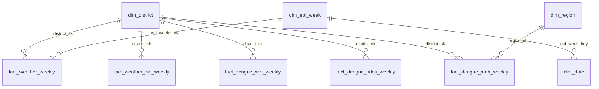

# Data model

DuckDB warehouse in three layers. Bronze files are never edited; silver tables are rebuilt from bronze on every
load; gold is built by dbt (plus the SCD2 region dimension, maintained in Python).

| Layer | Tables | Location |
|---|---|---|
| Bronze | raw weather CSVs, NDCU PDFs, WER history (`.rda`) | `data/bronze/` |
| Silver | `weather_daily`, `weather_weekly`, `dim_district`, `dim_rdhs`, `district_population`, `ndcu_weekly_cases`, `ndcu_moh_weekly_cases`, `wer_weekly_cases` | DuckDB `main` schema |
| Gold | dimensions, facts and marts below | DuckDB `gold` schema |
| ML | `ml.forecast_weekly`, `ml.forecast_latest` (view), `ml.drift_runs` | DuckDB `ml` schema |

## Gold layer

| Model | Grain |
|---|---|
| `dim_date` | calendar day, 2006-2027; maps each day to its epi week and ISO week |
| `dim_epi_week` | Sri Lankan epidemiological week (Saturday-Friday) |
| `dim_district` | district (25) plus an `unknown` member (`-1`) |
| `dim_region` | version of an MOH area (SCD Type 2, see [moh_regions.md](moh_regions.md)) |
| `fact_weather_weekly` | district x epi week |
| `fact_weather_iso_weekly` | district x ISO week |
| `fact_dengue_wer_weekly` | RDHS region x reported WER week (history, 2007-2026) |
| `fact_dengue_ndcu_weekly` | RDHS region x ISO week, with first-reported and latest (restated) counts |
| `fact_dengue_moh_weekly` | high-risk MOH area x ISO week, joined point-in-time to `dim_region` |
| `mart_ndcu_monitoring` | district x ISO week: cases, cases per 100,000, change, weather and rainfall lags |
| `mart_ml_features` | RDHS region x week: model features and targets (see [forecasting.md](forecasting.md)) |
| `mart_forecast_accuracy` | forecast (region x base week x horizon x model version) whose target week has passed |

## Conventions

- Surrogate keys are `md5` hashes of the natural key, so they are stable across rebuilds.
- Each dengue source keeps its native week system: WER on epi weeks, NDCU on ISO weeks. Weather is aggregated to
  both from daily data ([decision 0001](decisions/0001-two-week-systems.md)).
- Restated counts are kept next to the first report rather than overwriting it.
- `dbt build` runs 87 data tests: uniqueness, nulls, accepted ranges, relationships, grain, reconciliation with
  silver, cross-source checks and the alignment of ML targets (no leakage).
