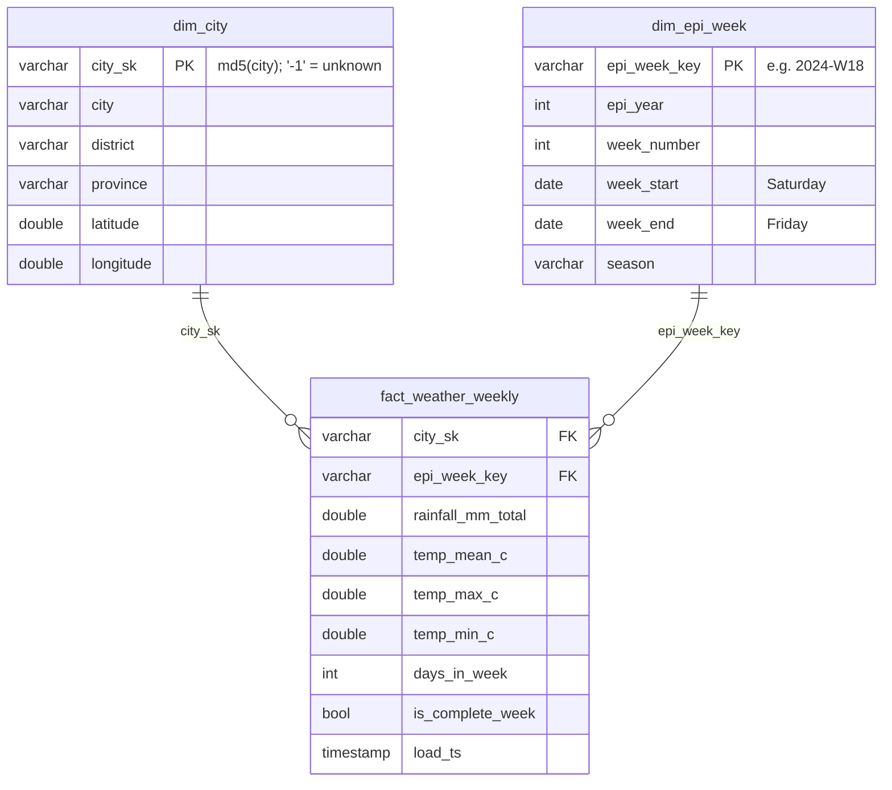

# Data model (gold layer) — current state

| Layer | Tables | Where |
|---|---|---|
| Bronze | raw CSV / HTML / PDF | `data/bronze/` |
| Silver | `weather_daily`, `weather_weekly`, `dim_city` (reference) | DuckDB `main` schema |
| Gold | `dim_epi_week`, `dim_city`, `fact_weather_weekly` | DuckDB `gold` schema |

Later: `dim_city` becomes `dim_region` (SCD2), and `fact_dengue_weekly` joins the same dimensions.
