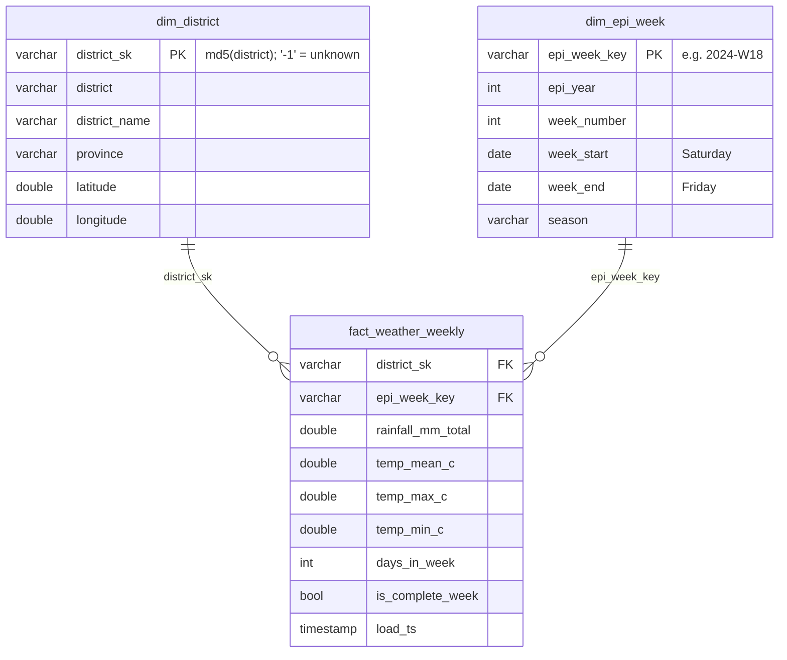

# Data model (gold layer) — current state

| Layer | Tables | Where |
|---|---|---|
| Bronze | raw CSV / HTML / PDF | `data/bronze/` |
| Silver | `weather_daily`, `weather_weekly`, `dim_district` (reference) | DuckDB `main` schema |
| Gold (dbt) | `dim_epi_week`, `dim_district`, `fact_weather_weekly`, `dim_region` (SCD2, Python) | DuckDB `gold` schema |

ML training table: `gold.mart_ml_features` (RDHS x WER week) - see [ml_features.md](ml_features.md).
